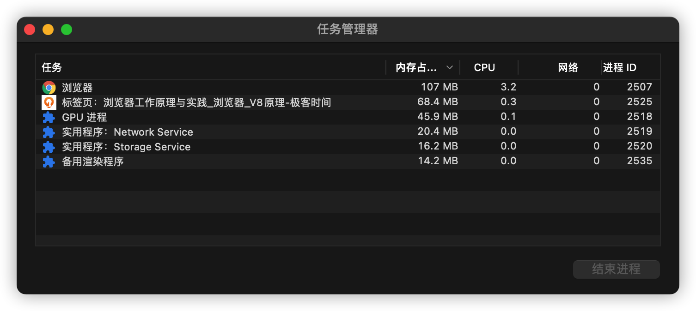
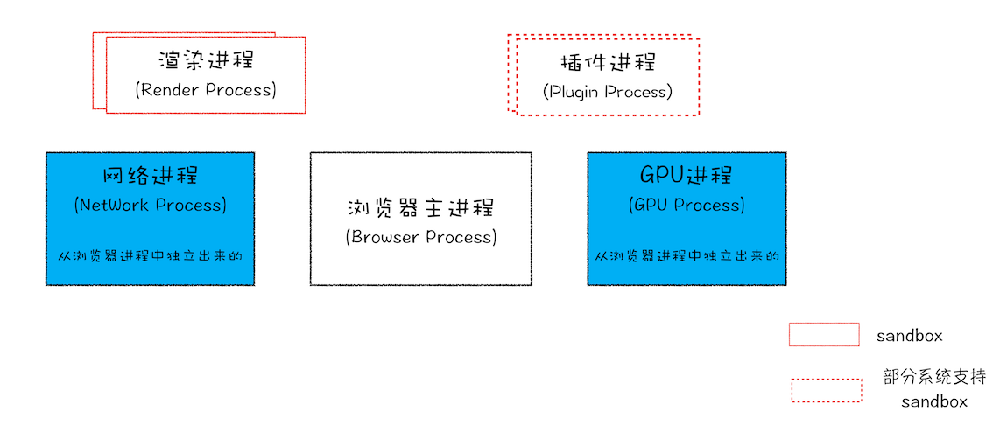

# 仅仅打开一个页面,为什么会有四个进程?

打开[传送门](https://time.geekbang.org/column/intro/216)页面,再打开浏览器任务管理器, 会发现有六个进程,为什么会有六个进程呢?

## 进程和线程, 并行和串行

### 进程和线程

进程: 程序启动时,操作系统为此程序创建一块内存,用来存放代码,运行产生的数据和执行任务的主线程,这样的运行环境称之为进程;

线程: 操作系统能够进行运算调度的最小单位,被包含在进程中,是进程的实际运作单位,一个进程可以并发多个线程,每个线程并行执行不同的任务;

### 进程和线程的关系

1.进程中任一线程执行出错, 会导致整个进程的崩溃;

2.线程之间共享进程的数据;

3.进程关闭,操作系统会回收进程所占内存;

4.进程之间相互隔离,使用 IPC 机制通信;

### 并行和串行

并行: 多个任务同时执行;

串行: 多个任务按先后顺序一个个执行;

## 浏览器发展史

### 单进程浏览器时代

描述: 浏览器所有功能模块运行在同一个进程中,包含网络模块,插件模块,JS 运行环境,页面渲染等;

缺点:  
01: 不稳定  
插件形式各样,插件的意外崩溃会导致浏览器进程的崩溃;  
JS 执行环境执行死循环类似的代码,同样可能引起渲染引擎的崩溃,进而导致浏览器的崩溃;

02: 不流畅  
运行复杂的页面再关闭,导致内存不能完全回收,时长越长,内存占用越高,浏览器越慢;  
死循环会导致页面失去响应,变卡顿;

03:不安全  
插件可以获取操作系统的任意资源,容易引发安全问题;  
页面脚本通过浏览器楼栋获取系统权限,也会引发安全问题;

### 多进程时代

#### 早期多进程架构

问题解决:  
01: 不稳定  
进程之间相隔离,单个页面或插件崩溃只会导致当前页面进程或插件崩溃,不会导致浏览器的崩溃,提高稳定性;

02: 不流畅  
JS 阻塞渲染进程,仅仅影响当前页面,不会影响浏览器其它页面;  
当页面关闭时,进程也关闭了,进程所占用的内存会被系统回收,解决了页面的内存泄漏问题;

03: 不安全  
插件和渲染进程运行在沙箱环境中,不能获取系统权限,不能读写硬盘数据,增强安全性;

#### 目前多进程架构

浏览器进程: 负责界面显示,用户交互,存储功能,子进程管理;  
渲染进程: 将 HTML,CSS,JavaScript 渲染为可交互的网页, 默认情况下,Chrome 会为每个 Tab 创建一个渲染进程,并运行在沙箱环境中;  
GPU 进程: 3D CSS, 网页绘制, UI 界面绘制;  
网络进程: 加载网络资源;  
插件进程: 在沙箱环境中运行插件,默认每个插件有一个单独的进程;

缺点:

01: 更高资源的占用  
每个进程都会包含公共基础结构的副本,浏览器会消耗更多的内存资源;

02: 更复杂的体系架构  
各模块之间耦合性高,扩展性差,很难适应新的需求;

#### 未来面向服务的架构(SOA)

## 问题解析

由目前的多进程浏览器架构中可以看出,打开一个页面,至少需要 1 个浏览器进程,1 个网络进程,1 个渲染进程,1 个 GPU 进程,1 个 Storage 进程, (任务管理器中的备用渲染进程可能是新版 Chrome 新增进程) 如果有运行插件,每个插件还需要再加一个插件进程;

## 共用渲染进程的情况

在 JS 中我们既可以通过 a 标签打开新的标签页,也可以通过 window.open 方法打开新的标签页,如果没有明显的设置 noopener 或 noreferrer,那么当前页面和新页面可以通过某种 opener 建立连接, 在 WhatWG 规范中,这类具有相互连接的标签页称之为 浏览上下文组;

浏览上下文: 一个标签页所包含的内容，诸如 window 对象，历史记录，滚动条位置等信息称为浏览上下文;  
浏览上下文组: 通过脚本相互连接起来的浏览上下文就是浏览上下文组;  
同一站点: 相同协议,且根域名相同的站点;

结论: 如果两个标签页位于同一个浏览上下文组且属于同一个站点,且没有设置 noopener 或 noreferrer,那么这两个标签页会被浏览器分配到同一个渲染进程中,否则将会使用不同的渲染进程渲染页面;

## 参考资料

[关于线程的简要介绍EN](https://www.internalpointers.com/post/gentle-introduction-multithreading)  
[关于线程的简要介绍CN](https://mp.weixin.qq.com/s/w0VETkkXI83Fu0YghpYlkw)
