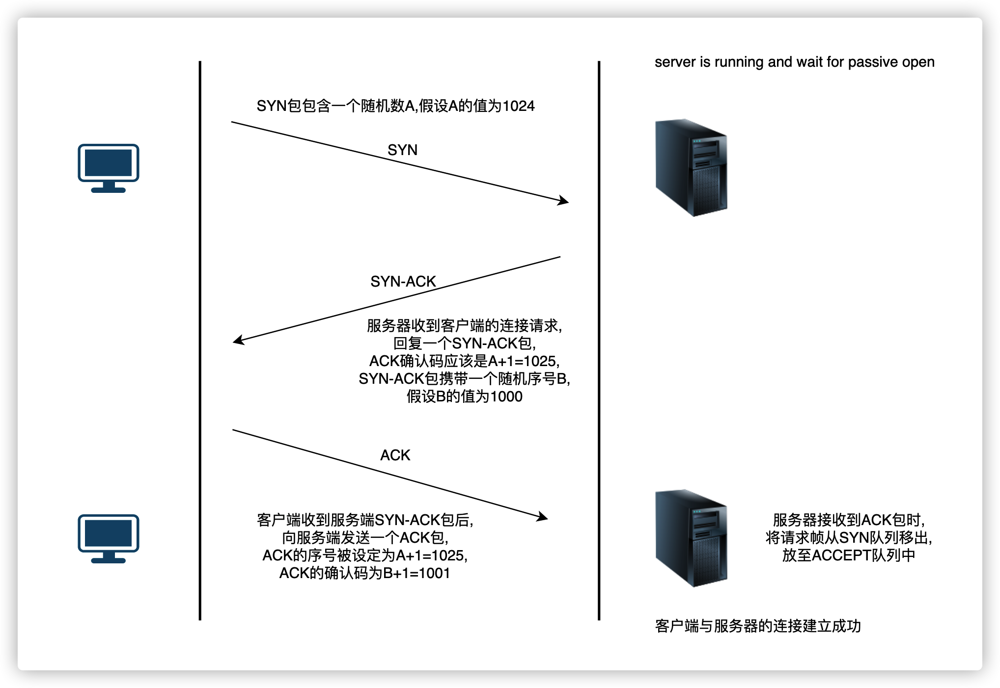

# TCP 协议: 如何保证页面文件能被完整送达浏览器

FP(First Paint): 页面加载到首次渲染的时长;

应用层: 规定应用程序的数据结构

传输层: 建立端口到端口的通信

网络层: 建立网络地址,以区分发送端和目的端是否处于同一子网络,建立主机到主机的通信

链路层: 定义了 0 和 1 的分组方式,规定解读电信号方式,即多少个电信号算一组,每个信号位代表什么?

物理层: 规定网络的电气特性,负责传输 0 和 1 的电信号

## 1.物理层

物理层定义电脑连接的物理手段,主要规定网络的电气特性,作用是负责传送 0 和 1 的电信号;

## 2.链路层

定义: 规定 0 和 1 的分组方式,多少个电信号算一组,每个信号位是什么意义?

### 以太网协议

以太网规定,一组电信号构成一个数据包,称之为 "帧(frame)",每一帧分成两个部分: 标头(Head)和数据(Data);

标头包含数据包的说明项, 比如发送者,接受者,数据类型等;

数据包含数据包的具体内容;

### MAC 地址

以太网协议规定数据包必须从一块网卡,传送到另一块网卡;

网卡的地址就是数据包的发送地址和接收地址;

### ARP: Address Resolution Protocol (地址解析协议)

基本功能: 在以太网协议中规定，同一局域网中的一台主机要和另一台主机进行直接通信，必须要知道目标主机的 MAC 地址。而在 TCP/IP 协议中，网络层和传输层只关心目标主机的 IP 地址。

这就导致在以太网中使用 IP 协议时，数据链路层的以太网协议接到上层 IP 协议提供的数据中，只包含目的主机的 IP 地址。于是需要一种方法，根据目的主机的 IP 地址，获得其 MAC 地址。

这就是 ARP 协议要做的事情。所谓地址解析（address resolution）就是主机在发送帧前将目标 IP 地址转换成目标 MAC 地址的过程。

另外，当发送主机和目的主机不在同一个局域网中时，即便知道对方的 MAC 地址，两者也不能直接通信，必须经过路由转发才可以。

所以此时，发送主机通过 ARP 协议获得的将不是目的主机的真实 MAC 地址，而是一台可以通往局域网外的路由器的 MAC 地址。

于是此后发送主机发往目的主机的所有帧，都将发往该路由器，通过它向外发送。这种情况称为委托 ARP 或 ARP 代理（ARP Proxy）。

在点对点链路中不使用 ARP，实际上在点对点网络中也不使用 MAC 地址，因为在此类网络中分别已经获取了对端的 IP 地址。

原理: 在每台安装有 TCP/IP 协议的电脑或路由器里都有一个 ARP 缓存表;

以主机 A（192.168.38.10）向主机 B（192.168.38.11）发送数据为例。

1.当发送数据时，主机 A 会在自己的 ARP 缓存表中寻找是否有目标 IP 地址。如果找到就知道目标 MAC 地址为（00-BB-00-62-C2-02），直接把目标 MAC 地址写入帧里面发送就可。

2.如果在 ARP 缓存表中没有找到相对应的 IP 地址，主机 A 就会在网络上发送一个广播（ARP request），目标 MAC 地址是“FF.FF.FF.FF.FF.FF”，这表示向同一网段内的所有主机发出这样的询问：“192.168.38.11 的 MAC 地址是什么？”

3.网络上其他主机并不响应 ARP 询问，只有主机 B 接收到这个帧时，才向主机 A 做出这样的回应（ARP response）：“192.168.38.11 的 MAC 地址是 00-BB-00-62-C2-02”，此回应以单播方式。这样，主机 A 就知道主机 B 的 MAC 地址，它就可以向主机 B 发送信息。同时它还更新自己的 ARP 高速缓存（ARP cache），下次再向主机 B 发送信息时，直接从 ARP 缓存表里查找就可。

| 主机名称 | IP 地址      | MAC 地址          |
| :------- | :----------- | :---------------- |
| A        | 192.168.2.11 | 00-AA-00-62-D2-02 |
| B        | 192.168.2.12 | 00-BB-00-62-C2-02 |
| C        | 192.168.2.13 | 00-CC-00-62-C2-02 |
| D        | 192.168.2.14 | 00-EE-00-62-C2-02 |

### 广播

发送方通过 ARP 协议找到接受方的 MAC 地址,怎么样才能将数据包准确送到接受方呢?

以太网采用广播的方式向本网络内的所有计算机发送,让每台计算机自己判断,是否为发送方;

当主机接收到网络中发来的数据包,会读取包的标头,找到接受方的 MAC 地址,然后和自己的 MAC 地址做对比,如果两者相同,则接受这个包,否则就丢弃这个包;

## 3.网络层

以太网依靠网卡的 MAC 地址可以实现两台主机的数据通信,但以太网协议采用广播的方式发送数据包,所有网络成员都能接收到数据包,然后对比自己是否是接受方,不仅效率低,而且局限于发送者所在的子网络;

那如果两台主机不在同一个子网络中,数据应该如何传输呢? 网络层应运而生;

网络层引进一套新的地址,是我们能够区分发送方和接受方是否属于同一个子网络,这套地址叫网络地址,简称网址;

如果发送方和接受方处于同一个子网络,则采用广播方式发送数据,否则采用路由方式发送数据;

网络地址确定计算机所在的子网络,MAC 地址将数据发送到该子网络中的目标网卡;

### IP 协议

规定网络地址的协议,叫做 IP 协议,IP 协议定义的地址,叫做 IP 地址;

IP 协议第四版本称之为 IPv4;

IP 协议第六版本称之为 IPv6;

|  | A 类 | B 类 | C 类 | D 类 | E 类 |
| :-- | :-- | :-- | :-- | :-- | :-- |
| IP 地址范围 | 1.0.0.0~127.255.255.255 | 128.0.0.0~191.255.255.255 | 192.0.0.0~223.255.255.255 | 224.0.0.0~239.255.255.255 | 240.0.0.0~247.255.255.255 |
| 可用 IP 地址范围 | 1.0.0.1~127.255.255.254 | 128.0.0.1~191.255.255.254 | 192.0.0.1~223.255.255.254 |  |  |
| 可分配给主机 | 是 | 是 | 是 | 否 | 否 |
| 网络数量 | 126 (2^7-2) | 16384 (2^14) | 2097152 (2^21) |  |  |
| 每个网络中可容纳主机数（个) | 16777214 (2^24-2) | 65534 (2^16-2) | 254 (2^8-2) |  |  |
| 适用范围 | 大量主机的大型网络 | 中等规模主机数的网络 | 小型局域网 |  |  |

一个 IP 地址由两个部分组成,前部分代表网络,后部分代表主机;

比如 192.168.2.1,怎么看出来,哪部分代表网络,哪部分代表主机呢? 答案是: 子网掩码;

子网掩码表示子网络的特征,形式上等同于 IP 地址,它的网络部分全部为 1,主机部分全部为 0; 地址: 192.168.2.1,如果已知网络部分是 24 位,主机部分是后 8 位,那么子网掩码就是 11111111.11111111.11111111.00000000,用十进制表示即为熟悉的 255.255.255.0;

已知子网掩码,就能判断发送方和接受方是否处于同一个子网络; 方法是将两个 IP 地址与子网掩码分别进行 AND 运算（两个数位都为 1，运算结果为 1，否则为 0）,如果结果相同,则证明为同一个子网络,否则则不是;

例如: 192.168.2.1 和 192.168.2.2,分别和 255.255.255.0 进行 AND 运算,结果都是 192.168.2.0,则他们处于同一个子网络;

IP 地址的作用主要有两个:  
1.为计算机分配 IP 地址;  
2.根据 IP 和子网掩码确定多个网络是否处于同一子网络;

### IP 数据包

使用 IP 协议发送的数据包称之为 IP 数据包,IP 数据包同样分为标头和数据两部分;

标头主要包括版本信息,数据长度,IP 地址等信息;标头的长度为 20-60 字节;

数据包含 IP 数据包的具体内容;

IP 数据包总长度最大为 65535 字节;

以太网数据包最大长度为 1500 字节,如果 IP 数据包大于 1500 字节,需要分割成多个以太网数据包发送;

## 4.传输层

有了 Mac 地址和 IP 地址,可以建立互联网上任意两台主机的通信; 但一台计算机上会同时运行多个程序,当一个数据包从互联网传输到主机时,主机如何知道它是发送给微信的,还是发送给直播的呢?

这个时候我们需要一个表示当前数据包发送程序的参数,这个参数就是端口;

端口是 0-65535 之间的一个整数,0-1023 的端口被系统占用,用户只能选择大于 1023 的端口;当应用程序运行时,会随机选择一个端口,与服务器的端口进行通信;

与网络层建立 "主机到主机的通信" 相比, 传输层建立 "端口到端口间的通信", 确定主机可端口,就能实现应用程序之间的通信;

### UDP: User Datagram Protocol 协议

UDP 是一个简单的面向数据报的通信协议,在 TCP/IP 模型中,UDP 为网络层以上和应用层以下提供了一个简单的接口;

UDP 只提供数据的不可靠传输,一旦把应用程序发送给网络层的数据发送出去,就不保留数据备份,在 IP 数据报的头部仅仅添加了复用和数据校验字段;

UDP 缺乏可靠性且属于无连接协议，所以应用程序通常必须容许一些丢失、错误或重复的数据包;

一些应用程序不太需要可靠性机制，甚至可能因为引入可靠性机制而降低性能，所以它们使用 UDP 这种缺乏可靠性的协议。流媒体，实时多人游戏和 IP 语音（VoIP）是经常使用 UDP 的应用程序。

应用:

1. 域名系统(DNS)
2. 动态主机配置协议(DHCP)
3. 简单网络管理(SNMP)
4. 路由信息协议(RIP)
5. 网络时间协议(NTP)

### TCP: Transmission Control Protocol 协议

TCP 是一种面向连接的,可靠的,基于字节流的传输层通信协议;

1. 应用层向 TCP 层发送用于网间传输的、用 8 位字节表示的数据流，然后 TCP 把数据流分割成适当长度的报文段（通常受该计算机连接的网络的数据链路层的最大传输单元（MTU）的限制）;
2. TCP 把结果包传给 IP 层，由它来透过网络将包传送给接收端实体的 TCP 层
3. TCP 为了保证不发生丢包，就给每个包一个序号，同时序号也保证了传送到接收端实体的包的按序接收。
4. 然后接收端实体对已成功收到的包发回一个相应的确认信息（ACK）,如果发送端实体在合理的往返时延（RTT）内未收到确认，那么对应的数据包就被假设为已丢失并进行重传。
5. TCP 用一个校验和函数来检验数据是否有错误，在发送和接收时都要计算校验和。

#### 简介

数据在 TCP 层称之为流(Stream),数据分组称之为分段(Segment);

数据在 IP 层称之为 Datagram,数据分组称之为分片(Fragment);

UDP 中分组称之为 Message;

#### 运行方式

TCP 运行分为三个阶段:

1. 连接创建(connection establishment)
2. 数据传送(data transfer)
3. 断开连接(connection termination)

##### 创建连接

TCP 使用三次握手 🤝 创建连接, 通常由服务端监听一个端口的连接(passive open: 被动打开),客户端发起对服务端的连接(active open: 主动连接);

当服务端执行完端口监听函数后,边在服务器上创建两个队列:

SYN 队列: 存放完成了二次握手的结果(半连接队列);

ACCEPT 队列: 存放完成三次握手的结果(全连接队列);

1. 客户端向服务端发送一个 SYN 包,请求一个主动连接; 该包携带客户端为这个连接请求而设定的随机数 A 作为消息序列号;
2. 服务端收到一个合法的 SYN 包后,将该包放入 SYN 队列中; 并回送一个 SYN/ACK; ACK 的确认码应为 A+1,SYN/ACK 包本身携带一个随机产生的消息序列号 B;
3. 客户端收到 SYN/ACK 包后,发送一个 ACK 包,该包的消息序列号被设定为 A+1,而 ACK 的确认码则为 B+1;
4. 服务端接收到 ACK 包时,将请求帧从 SYN 队列中移出,放至 ACCEPT 队列中;

如果服务器接收到了客户端发送的 SYN 请求后,回复了 SYN/ACK 包后客户端掉线,服务器并没有接收到客户端确认的 ACK 包, 此时连接处于挂起状态,既没有成功,也没有失败;服务器在一定时间内没有收到客户端确认的 ACK 包,会重新发送 SYN/ACK;  
Linux 下,默认重试次数为 5 次,重试的时间间隔从 1s 开始每次都翻倍,5 次的重试时间间隔分别为 1s,2s,4s,8s,16s,共 31 秒; 第五次重试发出后还要再等 32s 才能确定第五次也超时了,才会断开 TCP 连接;一共需要 31+32 = 63s;

TCP 请求参数:

1. tcp_synack_retries 请求重试次数
2. tcp_max_syn_backlog syn 最大连接数
3. tcp_abort_on_overflow 全连接队列满时,请求的处理行为 0:丢弃客户端请求 1:服务端发送给客户端重置请求(connection reset by peer)

SYN flood: 恶意攻击者通过跳过最后的 ACK 信息或在 SYN 里设置假的 IP 的地址,让服务器发送 SYN/ACK 包到造假的 IP 地址,导致服务器永远不可能收到 ACK;服务器需要分配资源给处于挂起状态的 TCP 连接; 当挂起状态连接数超过 SYN 队列时,新的连接创建会失败,导致服务器无法正常提供服务;

SYN flood 对策:

1. SYN cookie;
2. 限制同 IP 请求新连接数量;
3. 过滤;
4. 增加积压;
5. 减少 SYN-RECEIVED 定时;
6. SYN 缓存;
7. 防火墙和代理;

##### 数据传输

TCP 在数据传输阶段,使用很多机制保证了 TCP 的可靠性和强壮性;

1. 使用序号,对收到的 TCP 报文段进行排序以及重复数据的检测
2. 使用检验和检测报文段的错误保证无错传输
3. 使用确认和计时器检测和纠正丢包和延时
4. 流控制
5. 拥塞控制
6. 丢包重传机制

##### 可靠传输

每个 TCP 报文段中都有一对序号和确认号.TCP 报文发送者称自己的字节流编号为序号,称接收方接收的字节流编号为确认号;  
TCP 报文的接受者为确保可靠性,在接收到一定数量的连续字节流后才发送确认,称之为选择确认(Selective Acknowledgement),选择确认是的 TCP 及守着可以对乱序到达的数据块进行确认,每一个字节传输过后,SN 号都会递增 1;

正常的TCP传输

TCP重传机制

超时重传

快速重传

选择重传

重传重复接受信号

流量控制

拥塞控制

基于重复累计确认的重传

如果一个包（序号是 100）丢失，接收方就不能确认这个包及其以后的包，因为采用了累计 ack。  
接收方在收到 100 以后的包时，发出对包含第 99 字节的包的确认。这种重复确认是包丢失的信号。  
发送方如果收到 3 次对同一个包的确认，就重传最后一个未被确认的包。  
阈值设为 3 被证实可以减少乱序包导致的无作用的重传（spurious retransmission）现象。  
选择性确认(SACK)的使用能明确反馈哪个包收到了，极大改善了 TCP 重传必要的包的能力。
