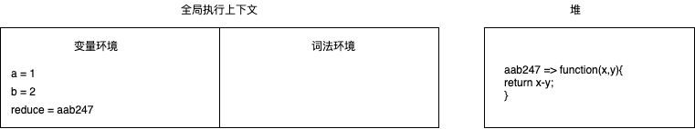
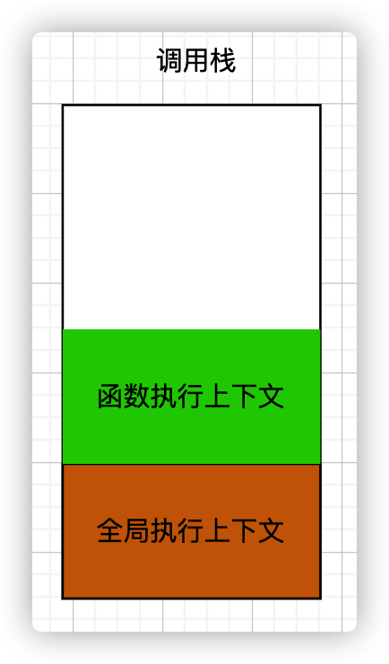

# 调用栈：为什么 JavaScript 代码会出现栈溢出？

创建执行上下文的条件

1. JavaScript 执行全局代码时,会编译全局代码并创建全局执行上下文(整个页面生命周期内,只有一个全局执行上下文)
2. 调用函数时,函数内的代码会并编译并创建函数执行上下文,函数结束后,函数执行上下文被销毁
3. 使用`let const`声明的代码块也会被编译并创建执行上下文

## 什么是调用栈?

调用栈是用来管理函数调用关系的数据结构,遵循先进后出的原则;

### 函数调用

```js
var a = 1;
var b = 2;
var reduce = function (x, y) {
  return x - y;
};
reduce(b, a);
```

JavaScript 引擎在执行上述代码前,会进行编译,创建全局执行上下文,包含自定义的变量和函数以及全局变量和函数, 当执行`reduce`函数时,会进行一下操作



1. 从全局上下文中找到函数 reduce 的代码
2. 对 reduce 函数代码进行编译,并创建 reduce 函数的执行上下文和可执行代码
3. 执行 reduce 函数的可执行代码
4. 退出 reduce 函数可执行上下文,回到全局执行上下文

这时,有全局执行上下文和 reduce 函数执行上下文,那如何管理多个执行上下文呢?JavaScript 引擎通过栈的结构来管理执行上下文;

### 栈

类似于商城的手推购物车,顶部不能直接拉取和塞入购物车,只能通过底部塞入或拉取购物车,进商城的时候取走最外层的购物车(出栈),离开的时候将购物车塞入(入栈)



JavaScript 调用栈

JavaScript 引擎使用栈的结构来管理执行上下文,执行上下文创建好后,JavaScript 引擎会将执行上下文入栈,代码执行完毕后,会将执行上下文出栈; 用来管理执行上下文的栈称之为执行上下文栈,又称调用栈

调用栈是 JavaScript 引擎追中函数执行的一个机制,当一次有多个函数被调用时,通过调用栈即可追踪到哪个函数正在执行以及个函数之间的调用关系;

栈溢出

调用栈有最大限制,当入栈的执行上下文超过最大限制时,JavaScript 引擎就会报错,这种错误称之为`栈溢出`

```js
function add(a, b) {
  return add(a, b);
}
console.log(add(1, 2));
```

当调用 add 函数时,就会创建 add 函数执行上下文并入栈,每次执行 add 函数都会生成一个新的执行上下文并入栈,所以只会入栈不会出栈,调用栈超过最大限制便会报错;
