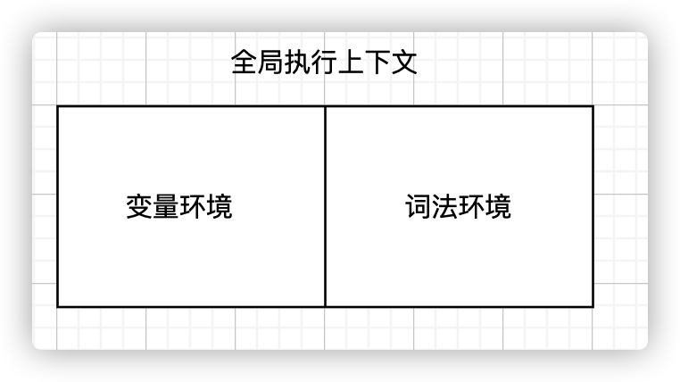
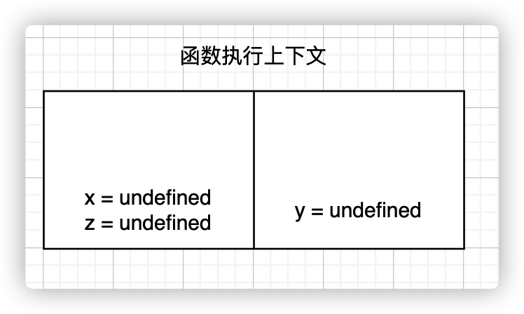
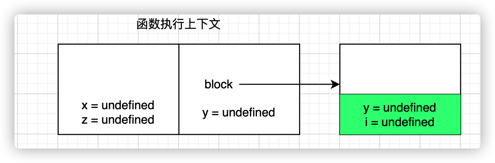

# 块级作用域：var 缺陷以及为什么要引入 let 和 const？

## 作用域 scope

作用域指程序中定义变量的区域,决定了变量的生命周期;

作用域就是变量与函数的可访问范围,作用域控制变量和函数的可见性和生命周期;

作用域类型

1. 全局作用域: 全局作用域的变量在代码的任何地方都能访问,其声明周期伴随页面的生命周期
2. 函数作用域: 函数内部定义的变量或函数,只能在函数内部被访问,函数执行结束后,变量和函数会被销毁;
3. 块级作用域: 使用一对大括号包裹的代码,代码块执行结束后,代码块内部的变量会被笑销毁;

## 变量提升的问题

1. 变量在不被察觉的情况下被覆盖
2. 本应销毁的变量没有被销毁

```js
// i 变量在for执行完毕后,没有被销毁
function test() {
  for (var i = 0; i < 10; i++) {}
  console.log(i);
}
test();
```

ES6 引入块级作用域解决变量提升缺陷

```js
// es5
function es5Test() {
  var num = 100;
  if (true) {
    var num = 20;
    console.log(num);
  }
  console.log(num);
}

// es6
function es5Test() {
  let num = 100;
  if (true) {
    let num = 20;
    console.log(num);
  }
  console.log(num);
}
```

JavaScript 如何支持块级作用域

JavaScript 通过引入词法环境来支持块级作用域

```js
function testBlockStatement() {
  var x = 10;
  let y = 20;
  {
    let y = 30;
    var z = 40;
    let i = 50;
    console.log(x);
    console.log(y);
  }
  console.log(y);
  console.log(z);
  console.log(i);
}
testBlockStatement();
```

1. 创建全局执行上下文,入栈全局执行上下文;  
   

2. 执行`testBlockStatement`前,创建函数`testBlockStatement`执行上下文,入栈`testBlockStatement`函数执行上下文  
   
3. 执行`testBlockStatement`,遇到块级作用域,创建词法栈,块级作用域入栈词法栈,执行完块级代码,块级作用域出栈  
   
4. 执行完`testBlockStatement`函数,`testBlockStatement`执行上下文出栈

在块级作用域内,let,const 声明的变量被提升,但变量只是创建被提升,初始化并没有被提升,在初始化之前使用变量,就会形成暂时性死区;
