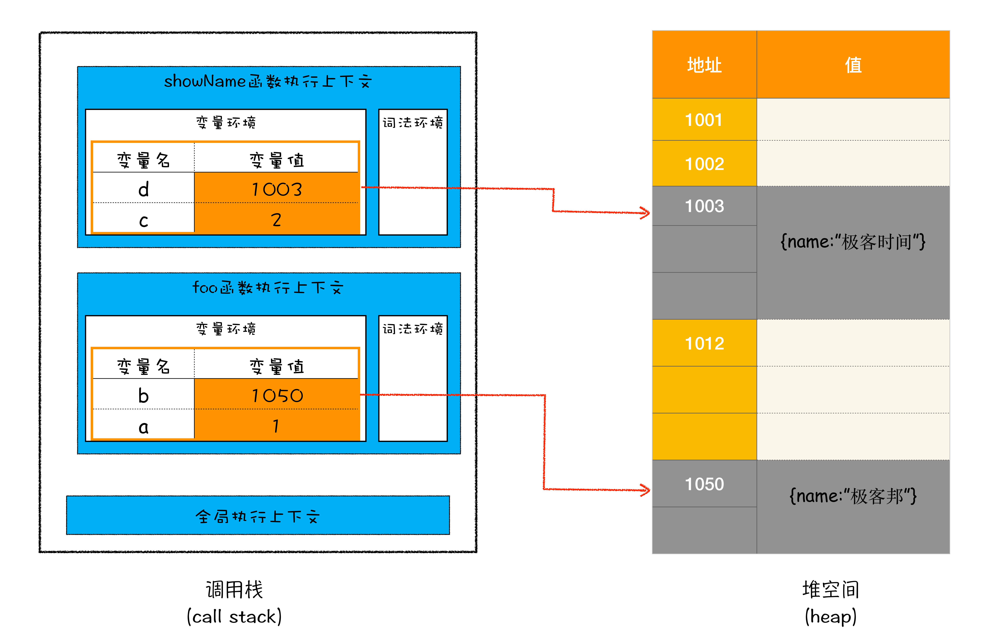

# 垃圾回收：垃圾数据是如何自动回收的？

## 为什么需要垃圾回收

原始数据类型存储在栈空间中,引用数据类型存储在堆空间;

有些数据被使用后,就不再需要了,我们把这种数据称为垃圾数据;

垃圾数据越来越多,占用的内存越来越大,剩余的内存空间越来越小,程序运行也会越来越慢,所以我们需要对垃圾数据进行回收,释放内存空间;

## 不同语言的垃圾回收策略

两种策略:

1. 自动回收: 由内部垃圾回收系统释放内存
2. 手动回收: 由代码来分配,销毁内存

## 栈空间中的数据如何回收

```js
function foo() {
  var a = 1
  var b = { name: "极客邦" }
  function showName() {
    var c = 2
    var d = { name: "极客时间" }
  }
  showName()
}
foo()
```



1. 如果执行到 showName 函数时，那么 JavaScript 引擎会创建 showName 函数的执行上下文，并将 showName 函数的执行上下文压入到调用栈中，最终执行到 showName 函数时，其调用栈就如上图所示。
2. 与此同时，还有一个记录当前执行状态的指针（称为 ESP），指向调用栈中 showName 函数的执行上下文，表示当前正在执行 showName 函数。
3. 当 showName 函数执行完成之后，函数执行流程就进入了 foo 函数，那这时就需要销毁 showName 函数的执行上下文了。
4. JavaScript 会将 ESP 下移到 foo 函数的执行上下文，这个下移操作就是销毁 showName 函数执行上下文的过程。
5. showName 的执行上下文虽然保存在栈内存中，但是已经是无效内存了
6. JavaScript 引擎再创建执行上下文时,showName 内存内容会被直接覆盖掉，用来存放新创建的执行上下文。

ESP: 记录当前执行上下文的指针;

总结:栈空间中,JavaScript 引擎会通过向下移动 ESP 来销毁该函数保存在栈中的执行上下文。

## 堆空间中的数据如何回收

foo 函数执行完成后,ESP 指向全局执行上下文,但堆内存中仍然存储着两个对象


要回收堆内存中的垃圾数据,需要使用 JavaScript 的垃圾回收器

## 垃圾回收策略

垃圾回收策略

1. 代际假说
2. 分代收集

代际假说

1. 大多对象在内存中存在时间很短,很多对象一旦分配完毕,很快就会不可访问
2. 不死的对象,存在时间很久;

分代收集

1. V8 将堆内存分为新生代和老生代两个区域
2. 新生代存放生存时间短的对象(大容量)
3. 老生代存放生存时间长的对象(通常支持 1-8M 的容量)

垃圾回收器

1. 副垃圾回收器负责新生代的垃圾回收
2. 主垃圾回收器负责老生代的垃圾回收

## 垃圾回收器的工作流程

垃圾回收执行流程

1. 标记空间中活动对象和非活动对象  
   活动对象: 存在引用的对象  
   非活动对象: 不存在引用的对象
2. 回收非活动对象占据的内存  
   标记完成后,统一回收非活动对象
3. 内存整理  
   频繁回收内存后,内存中存在大量不连续空间(内存碎片),当需要分配大量内存空间时,可能出现内存不足

## 副垃圾回收器

副垃圾回收器负责新生区的垃圾回收,使用 Scavenge 算法;

Scavenge 算法将新生区划分为两个区域,空闲区域和对象区域,新加入的对象存储在对象区域,当对象区域内存不足时,就执行一次垃圾回收;

1. 将对象区域的垃圾坐标记
2. 副垃圾回收器将存活的对象复制到空闲区域并将其有序的排列
3. 将空闲区域和对象区域相互调整,对象区域变成空闲区域,空闲区域变成对象区域

Scavenge 算法的问题

每次执行垃圾回收都需要将存活的对象复制到空闲区域,复制需要时间成本,为了执行效率,新生区的空间一般比较小

新生区内存空间小,很容易内存活的对象占满,为解决这个问题,引入对象晋升策略,即经过两次垃圾回收依然存活的对象,分配到老生区中

## 主垃圾回收器

## 全停顿问题
