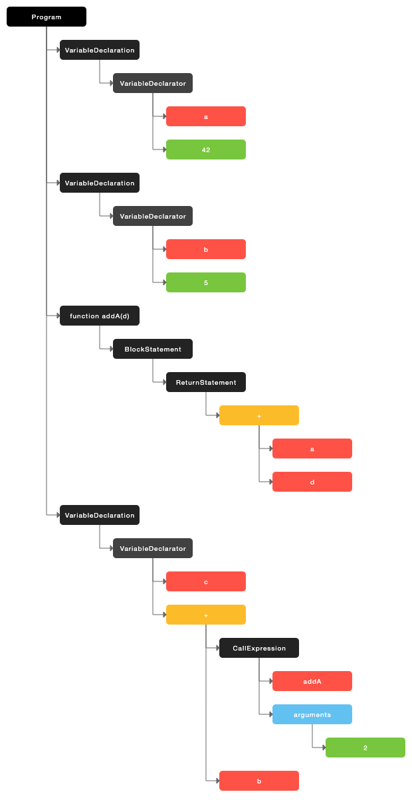

# 编译器和解释器：V8 是如何执行一段 JavaScript 代码的？

## 编译器 Compiler 和 解释器 Interpreter

机器不能直接理解代码,所以在执行代码前,需要将代码编译成机器能够读懂的语言

编译型语言: 程序运行前,经过编译器编译生成机器能够运行的二进制文件(C/C++,G0)

解释型语言: 每次运行时需要解释器对程序进行动态解释和执行(JavaScript,Python)

编译过程

1. 对源代码进行词法分析,语法分析,生成抽象语法树
2. 对抽象语法树进行词义分析和代码优化,生成二进制文件
3. 执行二进制文件

解释过程

1. 对源代码进行词法分析,语法分析,生成抽象语法树
2. 基于抽象语法树生成字节码,
3. 根据字节码执行程序,输出结果


## 抽象语法树 AST

[抽象语法树入门](https://github.com/jamiebuilds/the-super-tiny-compiler)

```js
var a = 42
var b = 5
function addA(d) {
  return a + d
}
var c = addA(2) + b
```



## 字节码 Bytecode

字节码

介于 AST 和机器码(二进制文件)之间的一种代码,需要解释器将其转换为机器码之后才能运行


## 即时编译器 JIT


## V8 如何执行一端代码?

V8 执行 JavaScript 代码流程(字节码+JIT)

1. 对源代码进行词法分析,语法分析,并生成抽象语法树(分词,解析)和执行上下文
2. 根据抽象语法树和执行上下文,解释器将 AST 转换为字节码(字节码占用空间远远小于机器码,减少系统内存占用)
3. 解释器 Ignition 在解释执行字节码的同时，收集代码信息，当频繁执行一端代码，TurboFan 编译器将频繁执行的字节码转换为机器码并保存，下次直接运行机器码。

## JavaScript 性能优化

优化 JavaScript 执行效率，你应该将优化的中心聚焦在单次脚本的执行时间和脚本的网络下载上，主要关注以下三点内容：

1. 提升单次脚本的执行速度，避免 JavaScript 的长任务霸占主线程，这样可以使得页面快速响应交互；
2. 避免大的内联脚本，因为在解析 HTML 的过程中，解析和编译也会占用主线程；
3. 减少 JavaScript 文件的容量，因为更小的文件会提升下载速度，并且占用更低的内存。
