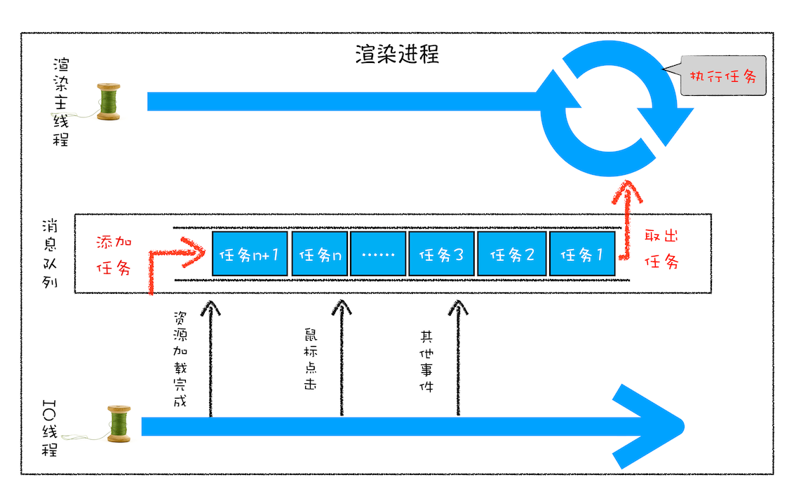

# 消息队列和事件循环：页面是怎么“活”起来的？

## 单线程处理固定任务

任务队列

1. 任务: 1+2
2. 任务: 20/5
3. 任务: 7\*8
4. 任务: 打印任务 1,任务 2,任务 3 的运算结果

```js
const task1 = 1 + 2
const task2 = 20 / 5
const task3 = 7 * 8
console.log(`计算结果===> 任务1:`, task1, `任务2:`, task2, `任务3:`, task3)
```


## 单线程处理任务过程中新增任务

情景:当执行任务时,用户突然点击按钮,要求新增一个任务?

引入事件循环机制,当有新的事件发生,线程就执行新的事件,然后输出事件执行结果


## 处理其它线程发送过来的任务

其它线程如何告知主线程执行其它任务呢?


使用消息队列

消息队列遵循`先进先出`原则,任务只能添加到尾部,只能从头部取出任务


1. 消息队列缓存待处理事务
2. IO 线程中产生的新任务添加进消息队列尾部
3. 渲染主线程循环的从消息队列头部中读取任务，执行任务。



## 处理其他进程发送过来的任务

1. 使用 IO 线程接受其他进程的消息,IO 线程将消息封装成任务发送给渲染主线程
2. 主线程将其添加到任务队列尾部
3. 事件循环系统不断从消息队列头部取出任务执行


## 消息队列任务类型

1. 输入事件（鼠标滚动、点击、移动）、微任务、文件读写、WebSocket、JavaScript 定时器
2. JavaScript 执行、解析 DOM、样式计算、布局计算、CSS 动画

## 安全退出

要退出当前页面时,页面主线程设置退出标志,事件循环系统每执行一个任务时,判断是否有退出标志,有则终端所有任务并退出,否则继续执行任务;

## 页面使用单线程的缺点

事件循环系统使用消息队列存储任务, 消息队列遵循`先进先出`原则,后放入的任务需要等待前面所有任务执行完毕才能执行,由此引发以下问题;

1. 如何处理高优先级的任务

   比如一个典型的场景是监控 DOM 节点的变化情况（节点的插入、修改、删除等动态变化），然后根据这些变化来处理相应的业务逻辑。

   一个通用的设计的是，利用 JavaScript 设计一套监听接口，当变化发生时，渲染引擎同步调用这些接口，这是一个典型的观察者模式。

   不过这个模式有个问题，因为 DOM 变化非常频繁，如果每次发生变化的时候，都直接调用相应的 JavaScript 接口，那么这个当前的任务执行时间会被拉长，从而导致执行效率的下降。

   如果将这些 DOM 变化做成异步的消息事件，添加到消息队列的尾部，那么又会影响到监控的实时性，因为在添加到消息队列的过程中，可能前面就有很多任务在排队了。

   这也就是说，如果 DOM 发生变化，采用同步通知的方式，会影响当前任务的执行效率；如果采用异步方式，又会影响到监控的实时性。

   那该如何权衡效率和实时性呢？针对这种情况，微任务就应用而生了，下面我们来看看微任务是如何权衡效率和实时性的。

   通常我们把消息队列中的任务称为宏任务，每个宏任务中都包含了一个微任务队列，在执行宏任务的过程中，如果 DOM 有变化，那么就会将该变化添加到微任务列表中，这样就不会影响到宏任务的继续执行，因此也就解决了执行效率的问题。

   等宏任务中的主要功能都直接完成之后，这时候，渲染引擎并不着急去执行下一个宏任务，而是执行当前宏任务中的微任务，因为 DOM 变化的事件都保存在这些微任务队列中，这样也就解决了实时性问题。

2. 如何解决单个任务执行过长

   因为所有的任务都是在单线程中执行的，所以每次只能执行一个任务，而其他任务就都处于等待状态。如果其中一个任务执行时间过久，那么下一个任务就要等待很长时间

   如果在执行动画过程中，其中有个 JavaScript 任务因执行时间过久，占用了动画单帧的时间，这样会给用户制造了卡顿的感觉，这当然是极不好的用户体验。针对这种情况，JavaScript 可以通过回调功能来规避这种问题，也就是让要执行的 JavaScript 任务滞后执行。


