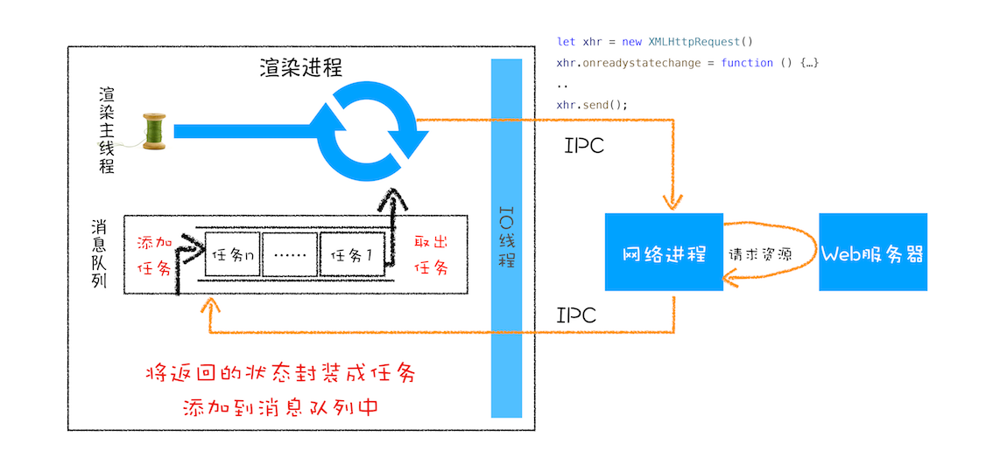

# WebAPI: setTimeout 和 XMLHttpRequest 是如何实现的？

[定时器 API](https://developer.mozilla.org/zh-CN/docs/Web/API/WindowOrWorkerGlobalScope/setTimeout)

[XMLHttpRequest API](https://developer.mozilla.org/zh-CN/docs/Web/API/XMLHttpRequest)

## 浏览器如何实现 setTimeout

Chrome 中除了正常的消息队列外,还有一个消息队列,这个队列维护延迟执行的任务列表,包含定时器和 Chromium 内部一些需要延迟执行的任务

当通过 JavaScript 创建一个定时器时,渲染进程会将该定时器的回调任务添加到延迟 hashmap 结构中;

当事件循环系统执行完消息队列的任务后,便开始执行延迟任务(根据延迟任务的发起时间和延迟时间计算出到期的任务,提取并依次执行到期任务);

设置定时器时会返回一个定时器 ID,当使用`clearTimeout`并传入定时器 ID,当这个定时器没有执行时,便会从延迟任务列表中移除;

## 使用 setTimeout 注意事项

1. 当前任务执行时间过长,会影响定时器任务的执行
2. setTimeout 存在嵌套调用,系统会设置最短时间间隔为 4 毫秒
3. 未激活的页面,setTimeout 执行最小间隔为 1000 毫秒
4. 延时执行有最大值
5. 使用 setTimeout 设置的回调函数中的 this 不符合直觉

```js
// 当函数由一个对象引导调用时，this 指向该对象。（隐式绑定）
var name = 1
var MyObj = {
  name: 2,
  showName: function () {
    console.log(this.name)
  }
}

setTimeout(MyObj.showName, 1000) // 1

// 解决方案
setTimeout(MyObj.showName.bind(MyObj), 1000)
setTimeout(() => MyObj.showName(), 1000)
setTimeout(function () {
  MyObj.showName()
}, 1000)
```

## 浏览器如何实现 XMLHttpRequest

### 回调函数 VS 系统调用栈

同步回调: 主体函数执行结束之前执行完毕,在主体函数的执行上下文中执行;

```js
function homeWork() {
  console.log(`I'm doing homeWork`)
}

function work(cb) {
  console.log(`start work`)
  cb()
  console.log(`finish work`)
}

work(homeWork())
```

异步回调: 主体函数执行结束之后执行;

1. 将异步函数当成任务,添加到消息队列尾部
2. 将异步函数添加到微任务列表中

```js
// 延迟2秒后执行homeWork
// 在主体函数work执行结束之后才执行homeWork

function homeWork() {
  console.log(`I'm doing homeWork`)
}

function work(cb) {
  console.log(`start work`)
  setTimeout(cb, 2000)
  console.log(`finish work`)
}
work(homeWork())
```

## XMLHttpRequest 运作机制

[Chromium XMLHttpRequest](https://chromium.googlesource.com/chromium/src/+/refs/heads/main/third_party/blink/renderer/core/xmlhttprequest)



## XMLHttpRequest 使用过程中的“坑”

### 跨域问题

同源策略是一个重要的安全策略，它用于限制一个 origin 的文档或者它加载的脚本如何能与另一个源的资源进行交互

同源定义: 如果两个 URL 的 protocol、port 和 host 都相同的话，则这两个 URL 是同源

同源示例:`http://store.company.com/dir/page.html`

| URL                                               | 结果   | 原因     |
| :------------------------------------------------ | ------ | -------- |
| `http://store.company.com/dir2/other.html`        | 同源   | 路径不同 |
| `http://store.company.com/dir/inner/another.html` | 同源   | 路径不同 |
| `https://store.company.com/secure.html`           | 不同源 | 协议不同 |
| `http://store.company.com:81/dir/etc.html`        | 不同源 | 端口不同 |
| `http://news.company.com/dir/other.html`          | 不同源 | 主机不同 |

[跨域资源共享](https://developer.mozilla.org/zh-CN/docs/Web/HTTP/CORS)

### HTTPS 混合内容的问题

HTTPS 混合内容: HTTPS 页面包含不符合 HTTPS 要求的内容,比如包含 HTTP 资源
