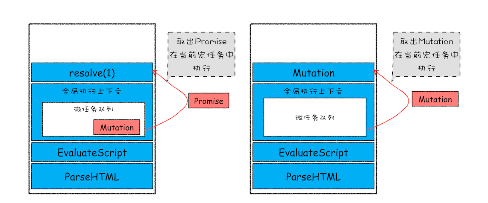

# 宏任务和微任务：不是所有任务都是一个待遇

## 宏任务

1. 渲染事件(解析 DOM,计算布局,绘制)
2. 用户交互事件(鼠标点击,滚动页面,放大缩小)
3. JavaScript 脚本执行事件
4. 网络请求,文件读写完成事件

## 微任务

1. Promise
2. MutationObserver

微任务的产生时机

1. 使用 MutationObserver 监控某个 DOM 节点，然后通过 JavaScript 来修改,添加、删除部分子节点，当 DOM 节点发生变化时，就会产生 DOM 变化记录的微任务。
2. 使用 Promise，当调用 Promise.resolve() 或者 Promise.reject() 的时候，也会产生微任务。

微任务的执行时机

在当前宏任务中的 JavaScript 快执行完成时，JavaScript 引擎会检查全局执行上下文中的微任务队列，然后按照顺序执行队列中的微任务。WHATWG 把执行微任务的时间点称为检查点。

如果在执行微任务的过程中，产生了新的微任务，同样会将该微任务添加到微任务队列中，V8 引擎一直循环执行微任务队列中的任务，直到队列为空才算执行结束。

