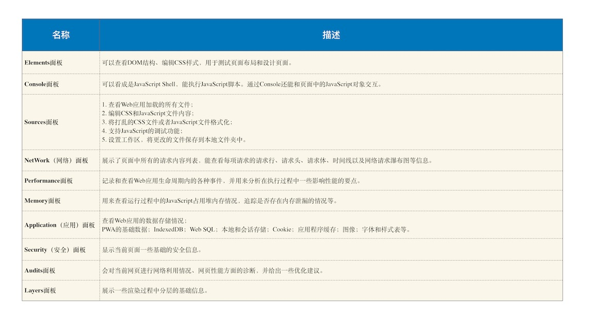
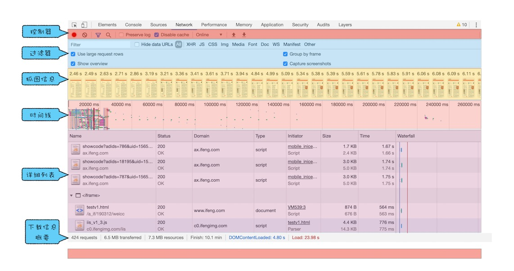
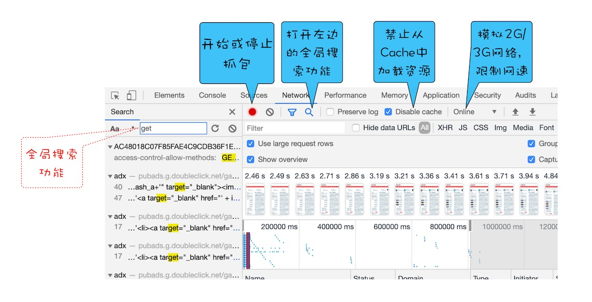
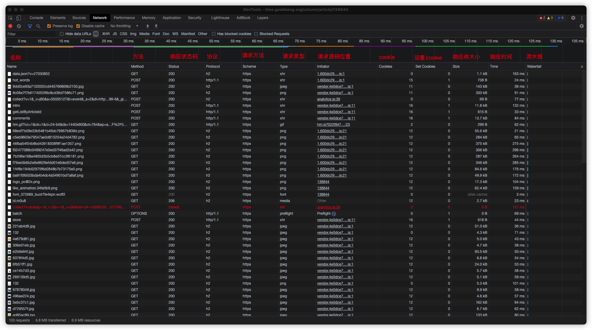
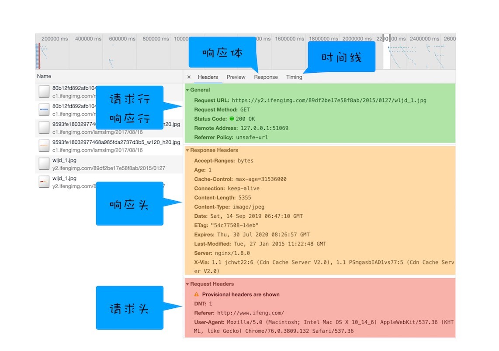
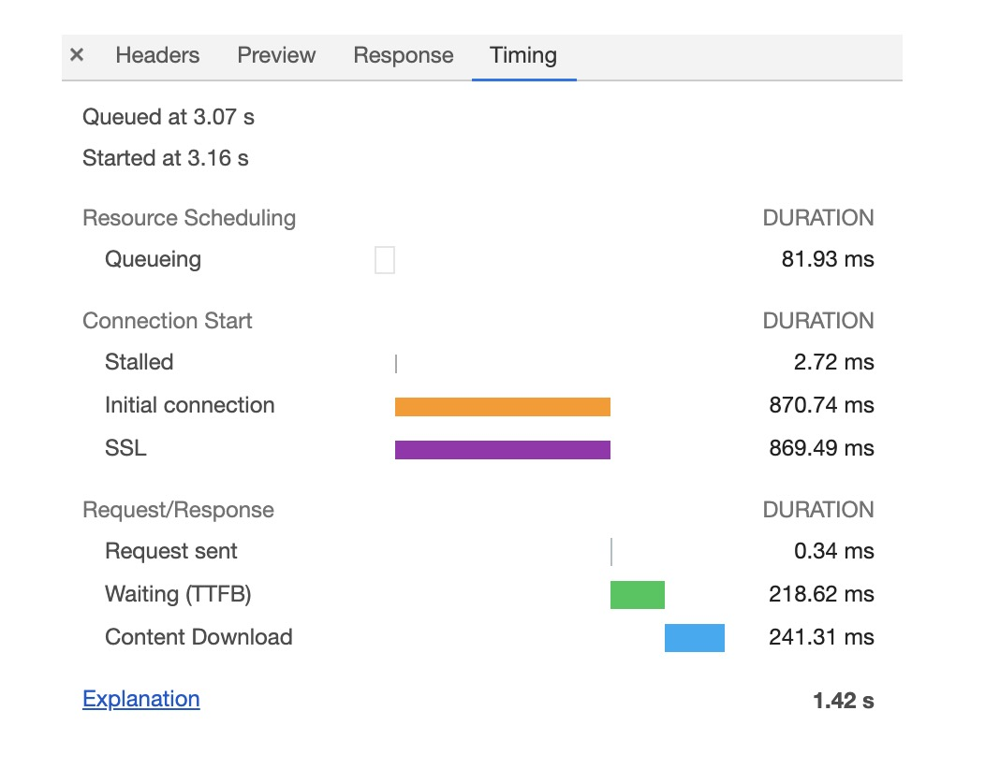

# Chrome 开发者工具：利用网络面板做性能分析

Chrome 开发者工具（简称 DevTools）是一组网页制作和调试的工具，内嵌于 Google Chrome 浏览器中。(按`F12`或者右键页面,点击检查即可打开)

## 网络面板

网络面板由控制器、过滤器、抓图信息、时间线、详细列表和下载信息概要这 6 个区域构成

### 控制器

1. 红色圆点的按钮，表示“开始 / 暂停抓包”
2. 全局搜索查找相关关键字的资源
3. “禁止从 Cache 中加载资源”，开启 Cache 会影响到网络性能测试的结果。(打开后,每次资源都从网络中请求)
4. 模拟网络情况,提供预设值,也可自定义网络情况

### 过滤器

根据不同类型或关键字过滤出想要看到的资源请求

### 抓图信息

抓图信息区域，可以用来分析用户等待页面加载时间内所看到的内容，分析用户实际的体验情况;

`控制器面板右侧齿轮(设置)打开 Capture screenshots即可启用屏幕截图`

### 时间线

时间线，主要用来展示 HTTP、HTTPS、WebSocket 加载的状态和时间的一个关系，用于直观感受页面的加载过程;多条竖线堆叠在一起，说明这些资源被同时被加载

### 详细列表(本章重点分析)

记录每个资源从发起请求到完成请求这中间所有过程的状态，以及最终请求完成的数据信息

列表属性

列表属性右键可以选择展示隐藏类目,点击可以根据当前类目排序;

请求详细信息

单个请求时间线

1. Queuing 及队列,浏览器发起请求时,很多原因导致请求不能立即发起,需要排队等待

   a. 页面当前资源存在优先级,核心资源优先级较高,非核心资源优先级相对较低,底优先级需要让位高优先级,进入排队状态

   b. Http1.x,浏览器为每个域名最多维护 6 个 TCP 连接,如果 6 个 TCP 连接都忙碌,请求将会处于排队状态

   c. 网络进程为数据分配磁盘空间时,新的 HTTP 请求需要短暂等待磁盘分配完毕

2. 排队完成后,在发起连接之前,还有原因可能导致连接过程被推迟(Stalled),表示停滞;
3. 如果使用代理服务器,将会增加 Proxy Negotiation 阶段(代理协商阶段),表示服务器连接协商所用的时间;
4. 进入 Initial connection/SSL 阶段(建立连接阶段),包括建立 TCP 连接花费的时间,如果使用 HTTPS,还需要额外的 SSL 握手时间
5. 建立连接后,网络进程准备数据并发送给网络(Request Send 阶段)
6. 数据发送后,开始等待接收服务器第一字节数据(Waiting: TTFB),TTFB(time to first byte)反应服务器响应速度;
7. 接收到第一字节后,陆续接受完成数据(Content Download 阶段)

### 下载信息概要

重点关注`DomContentLoaded`事件和`Load`事件

DomContentLoaded: Dom 构建完成,意味着 Dom 所需资源(JS,Css,Html)已加载完成

Load: 整个页面及所有依赖资源如样式表和图片都已完成加载(HTML,CSS,JS,Image,Media,Audio,Video...)

## 优化 Timeline 耗时项

1. 排队(Queuing)时间过久

   排队时间过久大多由于`浏览器为每个域名最多维护6个TCP连接`导致,那么可以将单个站点的资源放在多个域名下,便同时支持多个 TCP 连接资源请求(域名分片技术)

   将站点升级到 HTTP2,因为 HTTP2 不再存在`浏览器为每个域名最多维护6个TCP连接`限制

2. 第一字节(TTFB)时间过长

   服务器生成数据时间过久: 对于动态页面,服务器接收到页面请求,读取数据库数据并传入模板,然后渲染模板并返回给用户;某个环节出现问题,可能导致返回时间过久;通过增加缓存技术,对于相同查询返回缓存数据;

   网络原因: 网速过慢,带宽不足,使用 CDN 缓存静态资源,采用缓存技术

   发送请求头携带多余用户信息: 不必要的头信息,Cookie,服务器可能需要对每一项都处理,增加服务器处理时长,应尽量减少不必要头部信息和 Cookie

3. Content Download 过久

   数据文件过大,网络数据较慢, 主要减少文件大小,压缩源代码,去除注释信息;
