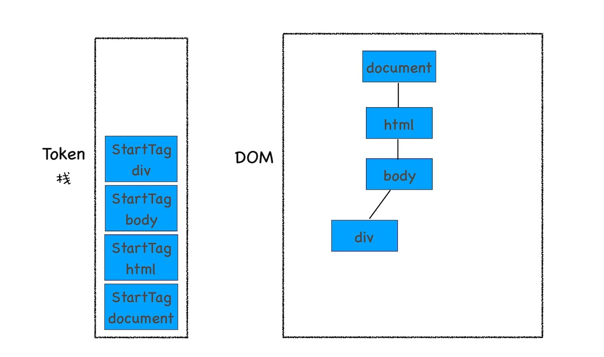

# DOM 树：JavaScript 是如何影响 DOM 树构建的？

# 什么是 DOM

从网络进程传给渲染引擎的 HTML 文件字节流无法直接被渲染引擎理解，所以要将其转化为渲染引擎能够理解的内部结构 DOM

DOM 作用: DOM 表述 HTML 的内部数据结构，将 Web 页面和 JavaScript 脚本连接起来，并过滤一些不安全的内容;

1. 从页面的视角来看，DOM 是生成页面的基础数据结构。
2. 从 JavaScript 脚本视角来看，DOM 提供给 JavaScript 脚本操作的接口，通过这套接口，JavaScript 可以对 DOM 结构进行访问，从而改变文档的结构、样式和内容。
3. 从安全视角来看，DOM 是一道安全防护线，一些不安全的内容在 DOM 解析阶段就被拒之门外了。

# 如何生成 DOM 树

HTML 解析器: 负责将 HTML 字节流转换为 DOM 结构;

HTML 解析器随着网络进程数据的加载不断的解析,并不是等待整个文档加载完成之后再解析;

解析流程

1. 网络进程接收到响应头之后，会根据响应头中的 content-type 字段来判断文件的类型，比如 content-type 的值是“text/html”，那么浏览器就会判断这是一个 HTML 类型的文件，然后为该请求选择或者创建一个渲染进程。
2. 渲染进程准备好之后，网络进程和渲染进程之间会建立一个共享数据的管道，网络进程接收到数据后就往这个管道里面放，而渲染进程则从管道的另外一端不断地读取数据，并同时将读取的数据“喂”给 HTML 解析器。
3. 网络进程接收到的字节流通过`管道`传递给渲染进程的 HTML 解析器，HTML 解析器动态接收字节流，并将其解析为 DOM

DOM 生成流程: 字节流转换为 DOM


## 分词: 将字节流转换为 Token

1. 分词器将字节流转换为 Token,分别为 Tag Token 和文本 Token
2. 将 Token 解析为 DOM
3. 将 DOM 节点添加到 DOM 树中

```html
<!-- 解析示例 -->
<html>
  <body>
    <div>1</div>
    <div>test</div>
  </body>
</html>
```

1. html 文件已字节流的形式传给 HTML 解析器(HTML 解析器开始工作时,默认创建一个跟为 document 的空 DOM 结构,同时会将 StartTag document 的 Token 压入栈底);
2. 分词器将字节流数据解析为 Tag Token 和文本 Token,第一个 Token 为 StartTag HTML,并将其压入栈中,同时创建 HTML 节点,添加到 document 上;

   

3. 同样的流程创建 StartTag body 和 StartTag div,将其分别压入 Token 栈并添加到 DOM 树中

   

4. 解析 div 内的文本 Token,压入 Token 栈并创建文本节点添加到 DOM 中,其父节点为 Token 栈顶元素(即 div)

   

5. 解析 EndTag div,HTML 解析器判断当前栈顶元素是否为 StartTag div,是则从栈顶弹出 StartTag div

   

6. 相同的规则一路解析,直到 EndTag HTML 弹出栈顶

   

## 安全检查模块

分词器将字节流解析为 Token 后,渲染引擎安全模块(XSSAuditor)将会检测词法是否安全(是否引用外部脚本,是否服务 CSP 规范,是否存在跨站点请求等),如果发现不合规内容,会对脚本或下载任务进行拦截;

## JavaScript 如何影响生成 DOM

当 HTML 解析器遇到`<script>` 标签前,和上面的解析流程相同,遇到`<script>`标签后,HTML 解析器将会暂停 DOM 的解析,因为 JavaScript 可能修改当前已经生成的 DOM 结构

```html
<!-- 内嵌JS堵塞DOM解析示例 -->
<html>
  <body>
    <div>1</div>
    <script>
      let div1 = document.getElementsByTagName("div")[0]
      div1.innerText = "change content"
    </script>
    <div>test</div>
  </body>
</html>
```

1. 解析到`<script>`标签前,HTML 解析器生成以下 DOM 树;

   

2. HTML 解析器暂停,JS 引擎介入,执行 script 标签中代码,div 节点内容修改为`change content`
3. 脚本执行完毕,HTML 解析器恢复解析,直到生成完整 DOM

```html
<!-- 引入JS堵塞DOM解析示例 -->
<html>
  <body>
    <div>1</div>
    <script type="text/javascript" src="foo.js"></script>
    <div>test</div>
  </body>
</html>
```

```js
// foo.js

//foo.js
let div1 = document.getElementsByTagName("div")[0]
div1.innerText = "time.geekbang"
```

1. 解析到`<script>`标签前,HTML 解析器生成以下 DOM 树;

   

2. HTML 解析器暂停,开始下载 JavaScript(foo.js)代码,下载完成后,JS 引擎介入,执行 script 标签中代码,div 节点内容修改为`change content`
3. 脚本执行完毕,HTML 解析器恢复解析,直到生成完整 DOM

问题:

下载 JavaScript 文件会阻塞 DOM 解析,下载过程通过非常耗时,收到网络情况和文件大小影响;

优化:

预解析: 渲染引擎接收到 HTML 字节流后,开启预解析线程,分析 HTML 文件中包含的 JavaScript,CSS 文件,解析到相关文件后提前下载文件

异步加载: 使用 async 和 defer 标记告诉 HTML 解析器此文件异步加载

压缩文件: 在发布上线之前使用工具压缩代码去除注释减少文件大小

CDN: 使用 CDN 加速文件下载

`js

<!-- async -->
<!-- 异步下载文件,在文件下载完毕后立即执行 -->
 <script async type="text/javascript" src='foo.js'></script>

<!-- defer -->
<!-- 异步下载文件,在DOMContentLoaded事件触发前执行 -->
 <script defer type="text/javascript" src='foo.js'></script>

`

```html
<!-- JS和CSS共同阻塞DOM解析示例 -->
<html>
  <head>
    <style src="theme.css"></style>
  </head>
  <body>
    <div>1</div>
    <script>
      let div1 = document.getElementsByTagName("div")[0]
      div1.innerText = "time.geekbang" //需要DOM
      div1.style.color = "red" //需要CSSOM
    </script>
    <div>test</div>
  </body>
</html>
```

```css
div {
  color: blue;
}
```

在执行 JavaScript 之前,浏览器不知道 JavaScript 是否操作了 CSSOM,所以在渲染引擎遇到 JavaScript 脚本时,无论是否操作了 CSSOM,都会执行 CSS 文件下载,解析 CSS,再执行 JavaScript 脚本;
